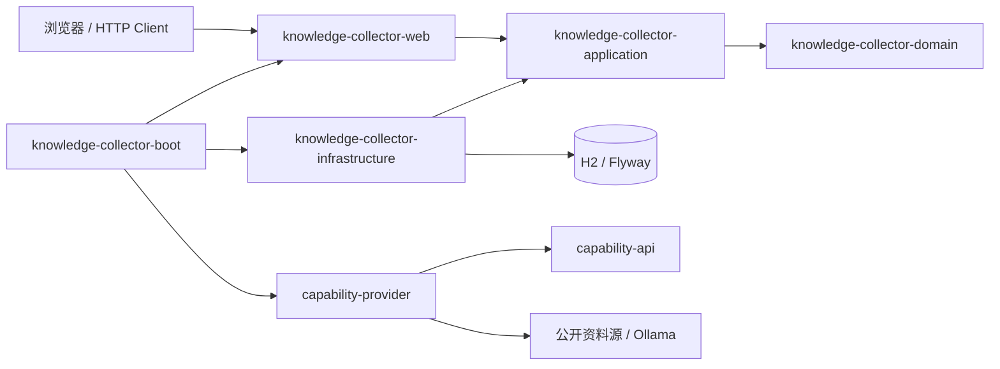

# Knowledge Collector

Knowledge Collector 是一个面向个人和小团队的本地资料采集、AI 研究与阅读管理系统。它把主题管理、公开来源采集、正文清洗、质量评估、AI 对话、审核入库、搜索阅读和归档整理放在同一个可离线保存数据的应用中。

项目采用模块化单体架构，默认仅监听 `127.0.0.1`，数据保存在本机 H2 数据库和文件目录中。当前版本完成至 Stage 27，已经从资料采集器升级为本地知识研究与写作工作台。

## 功能特性

- 主题、采集源、HTML 规则和固定周期调度管理。
- RSS、Atom、HTML List、JSON API、Manual URL 等公开来源 Provider。
- SearXNG 按主题、语言、数量、来源类型和质量等级发现候选，支持验证、导入与忽略。
- 统一第三方能力页面管理 Ollama 和 SearXNG 的配置、健康、模型、日志与重试。
- 采集源健康检查、最近刷新记录和批量状态刷新。
- 采集任务超时租约、失败重试、取消、最近七天默认查询和组合筛选。
- 正文抽取、安全清洗、URL 去重、主题匹配、质量评分和人工审核。
- 全文搜索、收藏、已读、标签、笔记、归档资料库和可配置整理规则。
- 本地 Ollama 文章分析、多轮聊天，以及 AI 回复待审核入库和来源标记。
- 文章结构化分析：摘要、大纲、观点、结论、数据、案例、实体和信息性质。
- 知识卡片、观点证据、实体合并、卡片关系和事件多来源聚合。
- 专题知识页、研究项目、带来源综合归纳、写作草稿、知识缺口和间隔复习。
- H2 + Flyway 持久化、本地备份恢复、Docker Compose 和 Android 离线资料包。
- Swagger UI、IntelliJ IDEA HTTP Client 请求集和 JUnit 集成测试。

## 系统架构



详细边界和数据流参见[系统架构说明](docs/03-design/system-architecture-design.md)。

## 技术栈

| 分类 | 技术 |
| --- | --- |
| 语言与构建 | Java 17、Maven Wrapper、多模块 Maven |
| 应用框架 | Spring Boot 3.5.16、Spring MVC、Validation、Actuator |
| 页面 | Thymeleaf、原生 JavaScript、响应式 CSS |
| 数据 | H2 文件数据库、Spring Data JPA、JdbcClient、Flyway V1—V13 |
| 采集 | JDK HttpClient、Rome、Jsoup、TLS 系统证书/附加 CA |
| AI | Ollama，可通过能力接口扩展其他 Provider |
| 测试 | JUnit 5、AssertJ、WireMock、Spring Boot Test |
| 部署 | 可执行 JAR、Docker Compose、Android SQLite 离线包 |

## 项目目录

```text
Knowledge Collector
├─ knowledge-collector-domain/              领域模型与规则
├─ knowledge-collector-capability-api/      外部能力接口
├─ knowledge-collector-capability-provider/ 默认采集、HTTP 与 Ollama 实现
├─ knowledge-collector-application/         应用服务与用例编排
├─ knowledge-collector-infrastructure/      数据库、存储、调度和备份适配器
├─ knowledge-collector-web/                 REST、MVC、模板和静态资源
├─ knowledge-collector-boot/                启动模块、配置与集成测试
├─ mobile-offline/                          Android 离线阅读工程
├─ docs/                                    产品、设计、开发、部署和用户文档
├─ http/                                    IntelliJ IDEA HTTP Client 请求
├─ scripts/                                 打包和文档检查脚本
├─ compose.yaml                             CPU Docker Compose
├─ compose.gpu.yaml                         NVIDIA GPU Compose 扩展
└─ pom.xml                                  Maven 聚合工程
```

## Quick Start

### 1. 准备环境

- 64 位 JDK 17 或更高版本；
- Git；
- Windows、Linux 或 macOS；
- 可选：本机 [Ollama](https://ollama.com/) 和 `deepseek-r1:14b` 模型。

项目自带 Maven Wrapper，不要求预先安装 Maven。首次构建需要访问 Maven Central 下载依赖。

### 2. 克隆并构建

```bash
git clone <your-repository-url>
cd WorkTwo
./mvnw clean verify
```

Windows PowerShell 或 CMD 使用：

```bat
mvnw.cmd clean verify
```

### 3. 启动

```bash
java -jar knowledge-collector-boot/target/knowledge-collector.jar
```

也可以运行 `start.bat`（Windows）或 `./start.sh`（Linux/macOS）。打开：

- 管理首页：<http://127.0.0.1:8080/>
- Swagger UI：<http://127.0.0.1:8080/swagger-ui.html>
- 健康检查：<http://127.0.0.1:8080/actuator/health>

未安装 Ollama 时，非 AI 功能仍可使用。需要 AI 功能时执行：

```bash
ollama pull deepseek-r1:14b
ollama serve
```

### 4. 使用 local 演示数据

```bash
./mvnw spring-boot:run -pl knowledge-collector-boot -am -Dspring-boot.run.profiles=local
```

`local` Profile 会启用演示主题、演示来源和 `/dev/tools`，不要用于公网部署。

## Docker Compose

```bash
docker compose up -d --build
docker compose logs -f app
```

Compose 会启动应用、Ollama 和 SearXNG，并使用命名卷保存数据库、模型和搜索配置。详细步骤、CPU/GPU 差异及升级方法见 [Docker Compose 指南](docs/06-deployment/docker-compose-guide.md)。

## 配置

常用环境变量：

| 环境变量 | 默认值 | 说明 |
| --- | --- | --- |
| `KNOWLEDGE_COLLECTOR_DATA_DIR` | `./data` | 数据根目录 |
| `KNOWLEDGE_COLLECTOR_SERVER_ADDRESS` | `127.0.0.1` | 监听地址 |
| `KNOWLEDGE_COLLECTOR_SERVER_PORT` | `8080` | 服务端口 |
| `KNOWLEDGE_COLLECTOR_TASK_STALE_TIMEOUT` | `PT10M` | 无心跳任务回收时间 |
| `KNOWLEDGE_COLLECTOR_OLLAMA_ENABLED` | `true` | 是否启用 Ollama Provider |
| `KNOWLEDGE_COLLECTOR_OLLAMA_BASE_URL` | `http://127.0.0.1:11434` | Ollama 地址 |
| `KNOWLEDGE_COLLECTOR_OLLAMA_MODEL` | `deepseek-r1:14b` | 默认模型 |
| `KNOWLEDGE_COLLECTOR_OLLAMA_TIMEOUT` | `PT2M` | 单次 AI 请求超时 |
| `KNOWLEDGE_COLLECTOR_SEARXNG_ENABLED` | `false` | 是否启用 SearXNG |
| `KNOWLEDGE_COLLECTOR_SEARXNG_BASE_URL` | `http://127.0.0.1:8088` | SearXNG 地址 |

完整列表、Profile、TLS 与生产建议见[配置参考](docs/06-deployment/configuration-reference.md)。示例值见 [.env.example](.env.example)。

## 文档导航

所有文档均可从 [docs 文档中心](docs/README.md) 访问。常用入口：

- [用户手册](docs/07-user-guide/user-manual.md)
- [知识研究工作台指南](docs/07-user-guide/knowledge-workspace.md)
- [安装手册](docs/08-operations/installation-manual.md)
- [部署指南](docs/06-deployment/deployment-guide.md)
- [配置参考](docs/06-deployment/configuration-reference.md)
- [开发者指南](docs/04-development/developer-guide.md)
- [系统架构](docs/03-design/system-architecture-design.md)
- [知识研究工作台设计](docs/03-design/knowledge-workspace-design.md)
- [API 设计](docs/03-design/api-design.md)
- [数据库设计](docs/03-design/database-design.md)
- [测试与手工接口验证](docs/05-testing/manual-api-testing.md)
- [常见问题](docs/09-faq/faq.md)
- [阶段报告索引](docs/stages/README.md)
- [更新日志](CHANGELOG.md)
- [贡献指南](CONTRIBUTING.md)
- [安全策略](SECURITY.md)

## 开发与验证

```bash
./mvnw clean verify
```

文档链接检查（Windows PowerShell）：

```powershell
powershell.exe -NoProfile -ExecutionPolicy Bypass -File ./scripts/check-doc-links.ps1
```

接口请求示例位于 `http/`。运行应用后，可直接在 IntelliJ IDEA 中执行 `.http` 文件。

## Roadmap

- 增加 OpenAI、兼容 OpenAI API 的云端 Provider 与可视化模型配置。
- 使用 Embedding/Clustering Provider 自动推荐相似文章、事件和知识关系。
- 增加综合结论的引用完整性、事实冲突和过期信息自动检测。
- 增强学术数据源、知识资产版本历史、全文搜索索引和可选图数据库投影。
- 增加身份认证、多用户权限和远程部署安全基线。
- 后续阶段再引入 GitHub Actions、Release 自动化和镜像发布。

版本变化见 [CHANGELOG](CHANGELOG.md)，阶段实现细节见[阶段报告](docs/stages/README.md)。

## FAQ

### 启动后无法使用 AI 功能？

确认 Ollama 正在监听 `127.0.0.1:11434`，目标模型已经通过 `ollama pull` 下载。应用本身可以在 Ollama 不可用时启动。

### 为什么默认只能从本机访问？

当前版本没有登录鉴权，默认绑定回环地址是安全设计。不要在未增加认证、TLS 和访问控制前绑定公网地址。

### 数据保存在哪里？

默认保存在 `./data`。升级、迁移或卸载前请先从运维页面创建备份。更多问题见[完整 FAQ](docs/09-faq/faq.md)。

## 安全与合规

项目只面向公开、允许访问的资料源，不提供绕过登录、验证码、付费墙、robots.txt 或证书验证的能力。发现安全问题时请按[安全策略](SECURITY.md)私下报告，不要在公开 Issue 中披露敏感细节。

## License

本项目使用 [Apache License 2.0](LICENSE)。提交贡献即表示同意按该许可证发布贡献内容。

## 致谢

感谢 Spring Boot、H2、Flyway、Rome、Jsoup、Ollama 及其开源社区。
