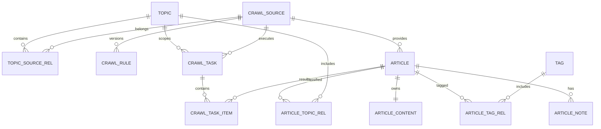

# 数据库设计

## 1. 设计原则

- H2 文件数据库用于第一版本本地部署。
- 所有正式结构由 Flyway 管理，JPA 使用 `ddl-auto=validate`。
- 主键统一 `BIGINT`，时间统一存储带明确约定的时间戳并由 Java Time API 处理。
- 枚举使用可读字符串；布尔字段使用明确默认值。
- 大正文采用 CLOB，原始快照采用相对文件路径。
- 删除优先软停用或显式确认；关键管理操作写审计。

## 2. ER 图

## 3. 通用字段约定

- `id BIGINT GENERATED BY DEFAULT AS IDENTITY`
- `created_at TIMESTAMP WITH TIME ZONE NOT NULL`
- `updated_at TIMESTAMP WITH TIME ZONE NOT NULL`
- 可并发修改的聚合增加 `lock_version BIGINT NOT NULL DEFAULT 0`
- 业务编码使用 `VARCHAR(64)` 并建立唯一约束
- URL 上限建议 2048；哈希固定 64 位十六进制

## 4. 表设计

### 4.1 topic

`id, topic_code, topic_name, description, keywords, excluded_keywords, color, icon, language, enabled, sort_order, lock_version, created_at, updated_at`

- 唯一：`uk_topic_code(topic_code)`、可选 `uk_topic_name(topic_name)`。
- 索引：`idx_topic_enabled_sort(enabled, sort_order)`。
- 关键词第一版以规范化分隔文本保存；若后续需要复杂管理再拆表。

### 4.2 crawl_source

`id, source_code, source_name, source_type, home_url, feed_url, language, charset, user_agent, timeout_seconds, max_retries, request_interval_millis, obey_robots, fetch_full_content, summary_only, save_snapshot, enabled, last_success_at, last_failure_at, consecutive_failures, notes, lock_version, created_at, updated_at`

- 唯一：`uk_source_code(source_code)`。
- 校验：timeout > 0、max_retries >= 0、interval >= 0。
- 索引：类型/启用、最后成功和连续失败。

### 4.3 topic_source_rel

`id, topic_id, source_id, created_at`

- 唯一：`uk_topic_source(topic_id, source_id)`。
- 外键：主题与来源；删除采用受控逻辑，不静默级联删除文章。

### 4.4 crawl_rule

`id, source_id, version, list_selector, link_selector, title_selector, content_selector, summary_selector, author_selector, publish_time_selector, tag_selector, next_page_selector, remove_selectors, json_item_path, json_title_path, json_url_path, active, created_at, updated_at`

- 唯一：`uk_rule_source_version(source_id, version)`。
- 数据库不直接保证“只有一个 active”；应用事务控制并辅以查询检查。

### 4.5 crawl_task

`id, task_no, retry_of_task_id, trigger_type, topic_id, source_id, status, discovered_count, created_count, duplicate_count, updated_count, skipped_count, failed_count, cancel_requested, manually_triggered, started_at, finished_at, duration_millis, error_code, error_message, lock_version, created_at`

- 唯一：`uk_task_no(task_no)`。
- 索引：`status`、`source_id + created_at`、`created_at`。

### 4.6 crawl_task_item

`id, task_id, original_url, normalized_url, url_hash, status, article_id, retry_count, error_code, error_message, started_at, finished_at, created_at`

Stage 10 的 V8 为 `crawl_task` 增加 `heartbeat_at`。活动任务使用
`active_source_id` 唯一约束防止同源并发，并按心跳租约回收异常中断任务。

- 唯一建议：`uk_task_item_url(task_id, url_hash)`。
- 索引：任务/状态、文章 ID。

### 4.7 article

`id, source_id, title, subtitle, author, summary, original_url, normalized_url, url_hash, language, publish_time, publish_time_inferred, first_collected_at, last_collected_at, content_updated_at, content_version, word_count, reading_minutes, quality_score, review_status, reading_status, favorite, archived, last_read_at, lock_version, created_at, updated_at`

- 唯一：`uk_article_url_hash(url_hash)`。
- 约束：quality_score 0—100、content_version >= 1。
- 索引：发布时间、采集时间、来源、状态、收藏、质量分。

### 4.8 article_content

`id, article_id, raw_html_path, clean_html CLOB, plain_text CLOB, content_hash, snapshot_path, created_at, updated_at`

- 唯一：`uk_article_content_article(article_id)`。
- 索引：`idx_article_content_hash(content_hash)`；是否全局唯一由去重策略决定，不强制唯一以支持人工保留。
- 路径必须是数据根目录下的相对路径。

### 4.9 article_topic_rel

`id, article_id, topic_id, match_type, confidence, manually_adjusted, match_reason, created_at`

- 唯一：`uk_article_topic(article_id, topic_id)`。
- confidence 为 0—100 整数。

### 4.10 tag 与 article_tag_rel

`tag(id, tag_name, color, created_at, updated_at)`

`article_tag_rel(id, article_id, tag_id, created_at)`

- 标签名唯一；关系 `(article_id, tag_id)` 唯一。

### 4.11 article_note

`id, article_id, note_content CLOB, created_at, updated_at`

第一版允许一篇文章多条笔记；如果 UI 只展示一条综合笔记，由应用层合并呈现。

### 4.12 system_setting

`id, setting_key, setting_value CLOB, value_type, description, updated_at`

`setting_key` 唯一。敏感值未来加密；第一版不保存登录凭据。

### 4.13 audit_log

`id, action_type, target_type, target_id, summary, detail_json CLOB, correlation_id, created_at`

detail_json 不得包含 Token、完整 Cookie 或正文。

### 4.14 article_ai_analysis

`article_id, provider, model, status, result_json CLOB, error_message, analyzed_at, updated_at`

一篇文章保存最近一次 AI 分析。结构化结果包含摘要、核心观点、关键词、标签、分类、阅读价值、Token 和耗时。

### 4.15 ai_conversation

`id, title, provider, model, created_at, updated_at`

保存 AI 研究助手会话及实际使用的 Provider/模型信息。

### 4.16 ai_chat_message

`id, conversation_id, role, content CLOB, provider, model, duration_ms, saved_article_id, created_at`

按时间保存用户和助手消息。助手消息保存资料库后回填 `saved_article_id`，避免重复入库。

### 4.17 article AI 来源扩展

`content_origin, ai_conversation_id, ai_message_id`

普通采集内容使用 `COLLECTED`；聊天回复保存后使用 `AI_GENERATED`，状态固定从
`PENDING_REVIEW` 开始，并关联原会话和消息。

## 5. 枚举

- SourceType：RSS、ATOM、HTML_LIST、JSON_API、MANUAL_URL。

## V12 知识研究工作台

| 表 | 对应阶段 | 说明 |
|---|---:|---|
| `knowledge_card`、`knowledge_relation` | 17 | 可复用卡片与卡片语义关系 |
| `knowledge_claim`、`claim_evidence` | 18 | 观点、文章/卡片证据和摘录 |
| `knowledge_entity`、`entity_reference` | 19 | 标准实体、别名合并和知识引用 |
| `knowledge_event`、`event_article` | 20 | 事件与多来源文章聚合 |
| `knowledge_topic_page` | 21 | 持续更新的专题知识页 |
| `research_project`、`research_item` | 22 | 研究目标、问题和证据矩阵 |
| `knowledge_synthesis` | 23 | 带来源引用的综合归纳 |
| `writing_draft` | 24 | 研究联动的提纲和草稿 |
| `knowledge_gap`、`knowledge_review` | 25 | 知识缺口、到期复习和复习历史 |

实体合并通过 `merged_into_id` 记录去向。外键删除规则根据资产语义选择 `CASCADE` 或 `SET NULL`，避免删除文章时误删独立研究结论。

## V13 第三方能力与来源发现

| 表 | 说明 |
| --- | --- |
| `third_party_service` | Provider 地址、模型、认证、启停、默认/备用角色和健康状态 |
| `third_party_call_log` | 业务场景、操作、状态、耗时、结果、失败原因和重试关联 |
| `source_discovery_candidate` | SearXNG 候选、评分、推荐原因、验证状态和导入来源 ID |

查询接口只返回“是否已配置认证信息”，不返回凭据正文。候选必须验证为 `VERIFIED` 才能转为正式采集源。

## V14 网页提取与原始证据

| 表 | 说明 |
| --- | --- |
| `content_extraction_job` | 文章/URL、实际方式、Provider、标题作者时间、正文、原始 HTML、截图、耗时、错误和重试关系 |
| `evidence_file` | 通用归属对象、文件类型、MinIO 对象键、MIME、大小、SHA-256、自动版本和 Provider |

提取任务保留嵌入的原始 HTML/截图用于即时查看；MinIO 可用时同时写入对象存储并建立 `evidence_file` 证据索引。相同 `owner_type + owner_id + file_kind` 的新文件按最大版本加一，旧版本不覆盖。
- CrawlTaskStatus：CREATED、RUNNING、PARTIAL_SUCCESS、SUCCESS、FAILED、CANCELED。
- TriggerType：MANUAL_SOURCE、MANUAL_TOPIC、SCHEDULED、RETRY。
- ReadingStatus：UNREAD、READ、ARCHIVED、IGNORED。
- ReviewStatus：NORMAL、PENDING_REVIEW、REJECTED。
- MatchType：SOURCE_DEFAULT、KEYWORD、MANUAL。

## 6. 索引策略

高频列表索引围绕 `article(publish_time, created_at, source_id, reading_status, favorite, quality_score)`。H2 对 CLOB 模糊搜索能力有限，第一版限制分页与查询长度；不在 CLOB 上假设高性能全文索引。达到性能阈值后替换为 Lucene 适配器。

## 7. 数据生命周期

- 主题/来源停用不删除历史文章。
- 任务和任务项按运维策略保留，默认不少于 90 天。
- 原始快照默认不保存；启用时可按来源和时间清理。
- 忽略/归档文章仍保留，用户显式删除才进入删除流程。
- 删除来源时必须选择：仅停用、删除配置保留文章、删除配置与关联内容。

## 8. 备份与恢复

备份时暂停写入或使用一致性方案，集合包括 H2 文件、article-content、snapshots 和配置清单。恢复前备份现状，恢复后执行 Flyway 校验、记录数抽查与内容路径检查。

## 9. 数据迁移

- Flyway 文件位于 boot/infrastructure 约定的 `db/migration`。
- 版本命名 `V{id}__description.sql`。
- 已发布迁移不修改，只追加新版本。
- 大数据变更分为兼容结构、回填、切换和清理步骤。

## 10. 清理策略

清理使用批次和上限，记录审计；不在同一事务删除大量 CLOB/文件。文件删除前验证规范化路径在数据根目录内，并处理数据库与文件操作失败的补偿。
# V16 用户与第三方系统

Flyway `V16__create_users_and_external_systems.sql` 新增 `app_user` 和 `external_system`。`app_user.password_hash` 只保存 BCrypt（cost 12）结果，角色受 `USER/ADMIN` 检查约束；登录时间和密码更新时间独立记录。`external_system` 保存入口地址、健康地址、打开方式、角色、排序、启停、最近检测/成功时间和安全截断后的失败原因。管理员操作继续复用 `audit_log`，不写密码、哈希或认证令牌。
