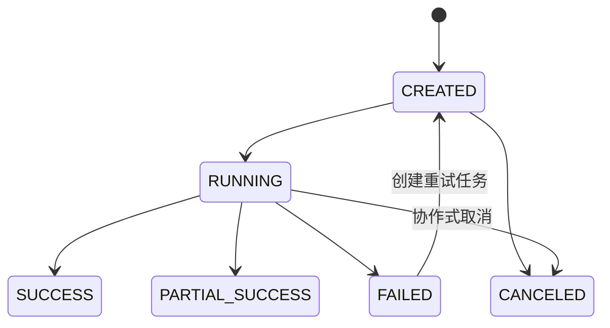
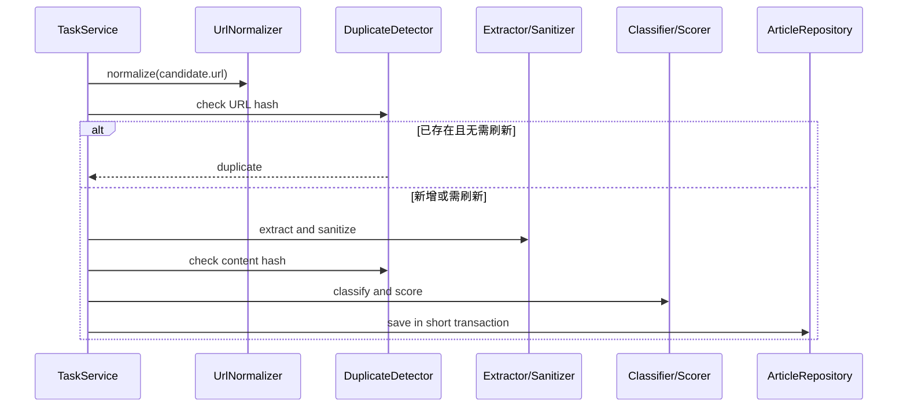

# 详细设计

## 1. 核心包设计

```text
com.example.knowledgecollector
├─ domain
│  ├─ topic source rule task article reading audit
│  └─ port
├─ application
│  ├─ command query service dto
│  └─ pipeline
├─ infrastructure
│  ├─ persistence http feed html storage scheduling
│  └─ config
├─ web
│  ├─ page api advice validation
│  └─ viewmodel
└─ boot
```

## 2. 核心模型

| 聚合/对象 | 责任 |
| --- | --- |
| Topic | 主题基本信息、启停和关键词规则 |
| CrawlSource | 来源类型、地址、网络限制、内容策略和健康状态 |
| CrawlRule | 某来源的不可覆盖版本化抽取规则 |
| CrawlTask/CrawlTaskItem | 采集执行状态、统计和单项错误 |
| Article/ArticleContent | 文章元数据、阅读状态、内容与版本 |
| Tag/ArticleNote | 用户整理与笔记 |

实体使用 Long ID；跨边界通过 ID 引用。枚举入库使用稳定字符串，禁止 ordinal。

## 3. 端口接口

```java
interface CrawlProvider {
    SourceType supportedType();
    SourceFetchResult fetch(CrawlSource source, CrawlContext context);
}

interface WebContentClient {
    WebResponse get(WebRequest request);
}

interface UrlNormalizer {
    NormalizedUrl normalize(String url, UrlNormalizationContext context);
}

interface ArticleContentExtractor {
    boolean supports(CrawlSource source);
    ExtractedArticle extract(HtmlDocument document, ExtractionRule rule);
}

interface ContentSanitizer {
    SanitizedContent sanitize(String html);
}

interface ArticleDuplicateDetector {
    DuplicateCheckResult check(ArticleCandidate candidate);
}

interface TopicClassifier {
    TopicClassificationResult classify(ArticleContent content);
}

interface ArticleQualityScorer {
    QualityScoreResult score(ArticleCandidate article);
}

interface ArticleSearchService {
    SearchResult search(ArticleSearchQuery query);
}

interface StorageService {
    StoredObject store(StorageRequest request);
}
```

`HtmlDocument` 是领域友好的抽象，避免 domain 直接依赖 Jsoup `Document`；Jsoup 适配留在 infrastructure。

## 4. Service 与 Repository 职责

- 应用服务：权限前置（未来）、加载聚合、用例编排、事务边界、发布审计。
- 领域服务：不属于单个实体的纯业务规则，如质量评分、主题匹配。
- Repository：聚合查询与持久化，不计算业务评分、不拼 HTML。
- Controller：请求/响应转换、校验、重定向，不开启跨多个仓储的业务事务。

## 5. DTO 设计

- Command DTO：创建/修改主题、来源、规则和文章状态。
- Query DTO：分页、排序和筛选。
- Result DTO：避免直接暴露 JPA 实体。
- ViewModel：页面专用组合数据。
- 采集 Pipeline 内部使用不可变 record/值对象传递候选项、提取结果和评分解释。

## 6. 规则版本设计

编辑已启用规则时创建 `version + 1` 新记录；旧版本保持不变。激活新版本与停用旧版本在同一事务完成，来源同一时间最多一个 active 规则。测试未保存草稿使用请求 DTO，不写正式规则表。

## 7. 任务状态机



不复用原失败任务直接回到 RUNNING；重试创建新任务并关联原任务，便于审计。状态更新使用乐观锁或条件更新防止重复完成。

## 8. URL 标准化

1. 以来源或列表页 URL 解析相对地址。
2. 限定 `http/https`。
3. 小写 scheme/host，移除默认端口和 fragment。
4. 规范路径中的点段与重复斜杠，但不破坏协议。
5. 删除明确跟踪参数，如 `utm_*`、`fbclid`、`gclid`。
6. 保留可能影响内容的其他查询参数，并按键值稳定排序。
7. 生成 UTF-8 规范字符串和 SHA-256 `url_hash`。

HTTP/HTTPS 不盲目互换；只在已知重定向结果中更新 canonical URL。

## 9. 内容提取与清洗

- HTML 规则源有有效 Selector 时优先定向提取。
- RSS/Atom 在允许采集正文时，依次尝试 Feed 内嵌全文和文章详情页静态正文；详情页使用语义选择器与文本密度评分抽取并执行安全清洗。
- 详情页抓取或抽取失败时保留 Feed 摘要，不把摘要冒充完整正文；重新采集可为已有空正文文章补写正文。
- 移除 script/style/noscript/iframe/form、导航、广告、评论和配置的 removeSelectors。
- Safelist 保留段落、标题、列表、引用、代码、表格和有限图片/链接属性。
- 清理内联事件、style、危险协议和跟踪属性。
- 相对链接转绝对链接；外链追加安全属性。
- 从安全 DOM 生成 cleanHtml 与 plainText，摘要从规范化纯文本截取。

## 10. 去重与版本

```text
先查 url_hash
├─ 不存在：继续内容哈希并创建
└─ 存在：
   ├─ content_hash 相同：只更新 last_collected_at
   └─ content_hash 不同：更新内容、version + 1、content_updated_at
```

若不同 URL 的 `content_hash` 完全相同，默认关联到已有文章并计为内容重复；保留来源候选 URL 的任务项记录。标题归一化只用于辅助提示，不作为唯一自动合并依据。

## 11. 主题匹配

评分顺序：

1. 来源默认主题加入候选。
2. 标题关键词命中权重高于正文。
3. 任一排除关键词命中时移除该主题候选。
4. 达到阈值的多个主题均可关联。
5. 人工调整写入 `manually_adjusted=true`，自动重跑不得覆盖。

结果记录 matchType、confidence（整数 0—100）和命中解释。

## 12. 质量评分

基础 100 分按可解释规则加减并截断到 0—100：

- 缺标题 -30；缺正文 -60；少于 200 字 -25。
- 无发布时间 -5；无作者 -3。
- 命中主题关键词 +5。
- 错误页/广告页强特征 -50。
- 来源可信度映射 -10 至 +10。

低于 40 默认待审核；实际权重进入配置并由单元测试锁定。

## 13. 搜索与阅读状态

数据库搜索使用 Specification/显式查询组合标题、摘要、正文、来源和标签。分页最大 100，默认 20。阅读状态与 favorite/archived 采用明确命令，归档时保持收藏；忽略内容默认从普通列表隐藏但可筛选恢复。

## 14. HTTP、重试与限速

- 连接和读取超时取来源配置并受系统上下限约束。
- 最大重定向 5；最大 HTML 响应 5 MB。
- 429、408、502、503、504 可按配置重试；400、401、403、404 不重试。
- 指数退避带轻微抖动，最大次数后停止。
- 同域默认并发 1，来源请求间隔至少 2000ms。

## 15. 事务边界

- 创建/修改主题、来源、规则：单应用服务事务。
- 创建任务：短事务；网络 I/O 不持有数据库事务。
- 每个候选文章处理：独立短事务，单项失败不回滚整批任务。
- 完成任务统计：独立事务，使用数据库计数或原子累加结果。
- 文件先写临时文件再原子移动；数据库失败时清理未引用文件。

## 16. 异常码

| 前缀 | 示例 | 含义 |
| --- | --- | --- |
| VAL | `VAL-001` | 输入校验 |
| RES | `RES-404` | 资源不存在 |
| SRC | `SRC-403` | 来源拒绝/合规限制 |
| NET | `NET-429` | 网络或限流 |
| PAR | `PAR-001` | 解析/提取失败 |
| DUP | `DUP-001` | 重复判定 |
| STO | `STO-001` | 数据库/文件存储 |
| SYS | `SYS-001` | 未分类内部错误 |

## 17. 核心处理时序


