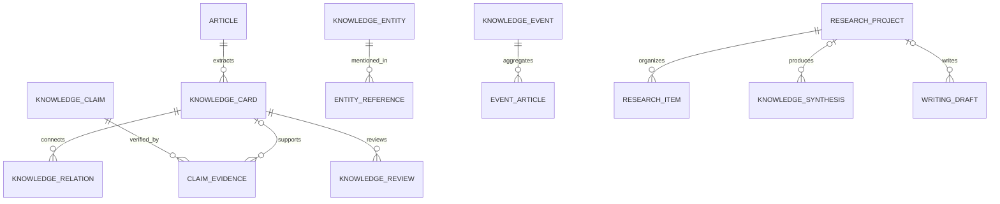

# 知识研究工作台设计

## 目标与边界

Stage 16–25 把原有“采集—阅读—归档”扩展为“结构化分析—卡片—证据—实体—事件—专题—研究—综合—写作—复习”。第一版使用 H2 普通关系表，不引入图数据库、向量数据库或外部搜索服务。

## 分层

- `capability-provider`：Ollama 负责结构化文章分析，未来 Provider 实现同一能力接口。
- `application`：`KnowledgeWorkspaceService` 校验类型、必填来源和关系规则。
- `infrastructure`：`JdbcKnowledgeWorkspaceGateway` 负责十二类知识资产和关系的持久化。
- `web`：`KnowledgeWorkspaceController` 提供 REST API，`/knowledge` 提供统一工作台。

## 数据关系

## 可追溯性

- 卡片可关联原始文章、原文摘录和位置。
- 证据可关联文章或卡片，并保存证据类型、摘录、引用和强度。
- 研究资料可关联文章、卡片或观点并记录用途。
- 综合归纳和写作草稿必须保留 `sourceReferences`。
- 实体合并保留 `merged_into_id`，不会直接删除历史实体。

## AI 安全原则

AI 分析温度为 0，提示词要求只使用所给正文，不存在的字段返回空数组。AI 推荐卡片必须人工确认；系统不把模型输出自动标记为已核验事实。

## 后续扩展点

- 使用 `EmbeddingProvider` 实现相似文章自动聚类。
- 使用 `ContentClusteringProvider` 生成事件候选。
- 把实体和卡片关系投影到图数据库，但 H2 仍作为事实来源。
- 为综合和写作增加引用完整性、矛盾检测和版本历史。
