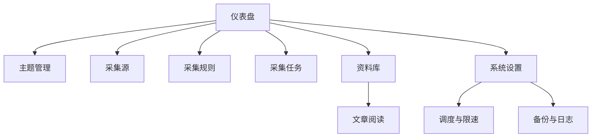

# 原型设计文档

## 1. 信息架构



全局左侧导航保持稳定，顶部栏放置全局搜索、当前时间和快捷“执行采集”。桌面端采用侧栏，窄屏切换为抽屉导航。

## 2. 页面导航

| 页面 | 路由建议 | 主要入口 | 主要去向 |
| --- | --- | --- | --- |
| 仪表盘 | `/` | 默认首页 | 任务详情、文章详情、来源列表 |
| 主题列表/表单 | `/topics`、`/topics/new` | 侧栏 | 编辑、关联来源 |
| 来源列表/表单 | `/sources`、`/sources/new` | 侧栏 | 测试、规则、执行任务 |
| 规则列表/编辑 | `/rules`、`/rules/{id}` | 来源详情 | 版本、复制、测试预览 |
| 任务列表/详情 | `/tasks`、`/tasks/{id}` | 侧栏/仪表盘 | 失败项、文章详情 |
| 资料库 | `/articles` | 侧栏/搜索 | 阅读详情 |
| 阅读详情 | `/articles/{id}` | 资料库 | 上一篇、下一篇、原文 |
| 系统设置 | `/settings` | 侧栏 | 调度、备份、日志 |

## 3. 全局布局

```text
┌──────────────────────────────────────────────────────────┐
│ Logo / Knowledge Collector    [全局搜索] [执行采集]      │
├──────────────┬───────────────────────────────────────────┤
│ 仪表盘       │ 面包屑 / 页面标题             页面操作   │
│ 主题         ├───────────────────────────────────────────┤
│ 采集源       │ 筛选或摘要区                              │
│ 采集规则     ├───────────────────────────────────────────┤
│ 采集任务     │ 主内容：表格 / 表单 / 阅读正文           │
│ 资料库       │                                           │
│ 系统设置     │                                           │
└──────────────┴───────────────────────────────────────────┘
```

## 4. 仪表盘

```text
[今日新增] [今日任务] [待阅读] [收藏] [失败] [启用来源]

┌ 最近采集任务 ───────────┐  ┌ 最近新增文章 ───────────┐
│ 状态 来源 新增 耗时     │  │ 标题 主题 来源 时间     │
└─────────────────────────┘  └─────────────────────────┘

┌ 各主题文章数 ───────────┐  ┌ 来源成功率 ─────────────┐
│ 横向条形/数值列表       │  │ 来源 成功率 连续失败    │
└─────────────────────────┘  └─────────────────────────┘
```

卡片可点击进入带预设筛选条件的列表。失败卡片使用文字和图标，不只依赖红色。

## 5. 主题与来源页面

### 5.1 主题列表

- 字段：名称、编码、关键词摘要、来源数量、启用状态、排序、更新时间。
- 操作：新建、编辑、启停、查看关联来源。
- 空状态：“尚未创建主题”，提供主按钮。

### 5.2 主题表单

名称、编码、描述、颜色、图标、语言、关键词、排除关键词、排序、启用。关键词采用可删除的标签输入；保存失败时字段旁显示原因。

### 5.3 来源列表

- 筛选：类型、主题、启用、健康状态、关键词。
- 字段：名称、类型、主题、最后成功、连续失败、状态。
- 操作：新建、编辑、测试、立即采集、启停。

### 5.4 来源表单

基础信息、网络限制、合规选项、内容策略和备注分组展示。切换来源类型时只展示相关字段，但不静默丢弃已有配置。

## 6. 采集规则测试

```text
┌ 规则编辑 ────────────────────┬ 测试输入 ───────────────┐
│ listSelector                 │ 测试 URL                │
│ linkSelector                 │ [执行测试]              │
│ title/content/...            ├─────────────────────────┤
│ removeSelectors              │ 候选链接 / 标题 / 作者  │
│ 版本、启用                   │ 安全正文预览 / 错误      │
└──────────────────────────────┴─────────────────────────┘
```

测试操作只生成临时预览，不写入文章表。预览明确标识响应状态、耗时、命中元素数和清洗警告。

## 7. 采集任务

- 列表筛选：状态、触发类型、来源、主题、时间。
- 列表字段：任务号、状态、来源、发现/新增/重复/失败、开始时间、耗时。
- 详情：统计摘要、错误信息、任务项分页表和操作日志。
- 允许操作：运行前取消；失败任务有限重试；运行中只展示当前状态，不承诺强制中断正在进行的单个 HTTP 请求。

## 8. 资料库

```text
┌ 筛选栏：关键词 主题 来源 状态 标签 质量 时间 [重置] ┐
├──────────────────────────────────────────────────────┤
│ □ 标题                            [收藏] [未读]      │
│   摘要……  主题 / 来源 / 发布时间 / 质量分          │
├──────────────────────────────────────────────────────┤
│ ...                                                  │
└────────────────────────────── 分页 / 排序 ───────────┘
```

筛选条件写入查询参数，刷新和返回后仍可恢复。加载时显示骨架行；无结果时区分“库为空”和“筛选无匹配”。

## 9. 阅读详情

正文最大宽度约 760px，标题与来源元数据置顶。操作区包含收藏、已读、归档、忽略、标签和笔记。原文在新标签页打开并添加安全链接属性。

```text
标题
来源 · 作者 · 发布时间 · 预计阅读 8 分钟  [查看原文]
[主题] [标签]                   [收藏] [已读] [归档]
────────────────────────────────────────────
清洗后的正文
────────────────────────────────────────────
个人笔记
[上一篇]                                      [下一篇]
```

## 10. 系统设置与运维

- 请求策略：默认超时、重试、请求间隔、User-Agent、最大响应。
- 调度：启用状态、固定周期、下次执行提示。
- 存储：数据目录只读展示、空间提示、备份入口。
- 日志：按级别和时间筛选，敏感字段不显示。

## 11. 通用交互状态

| 状态 | 设计 |
| --- | --- |
| 加载 | 局部骨架或旋转图标，按钮禁用并显示进行中 |
| 成功 | 页面内提示，避免只用短暂 toast 承载关键结果 |
| 校验失败 | 字段旁错误 + 顶部摘要，焦点移到首个错误 |
| 系统失败 | 显示可理解消息、错误编号和重试/返回入口 |
| 空状态 | 解释原因，提供最相关的下一步操作 |
| 危险操作 | 二次确认，说明影响范围，不使用默认焦点 |

