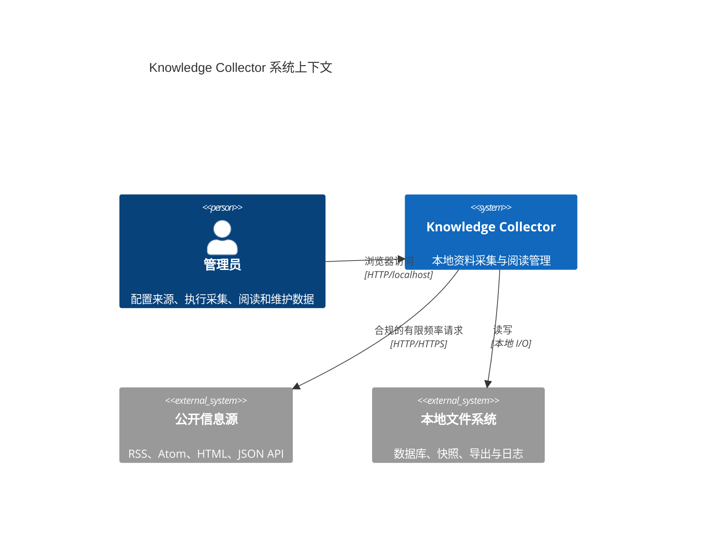
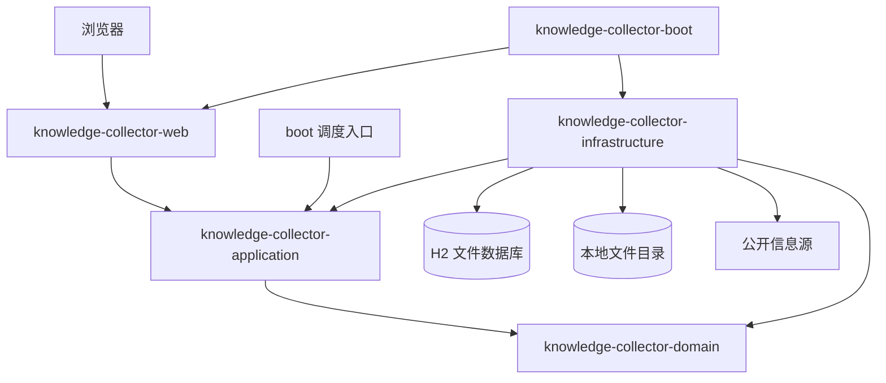
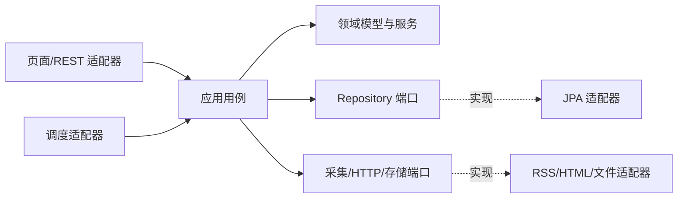
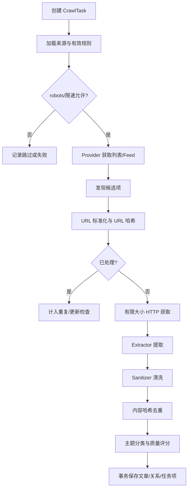
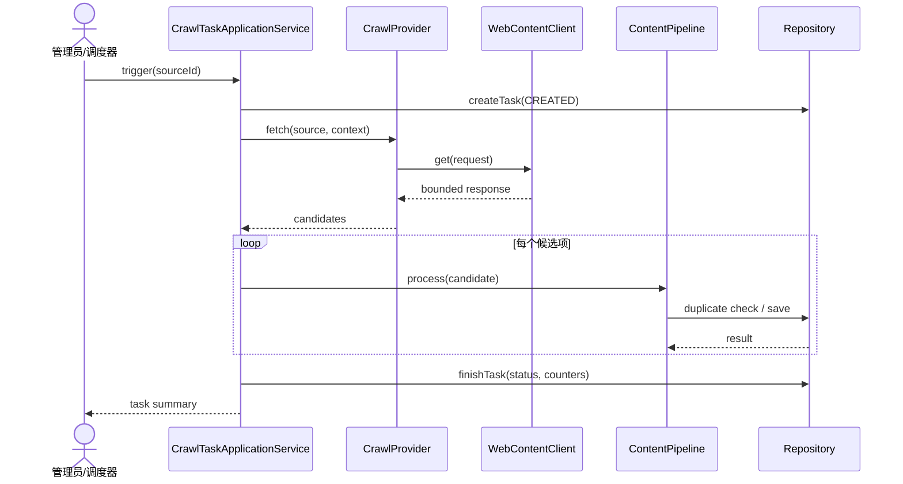
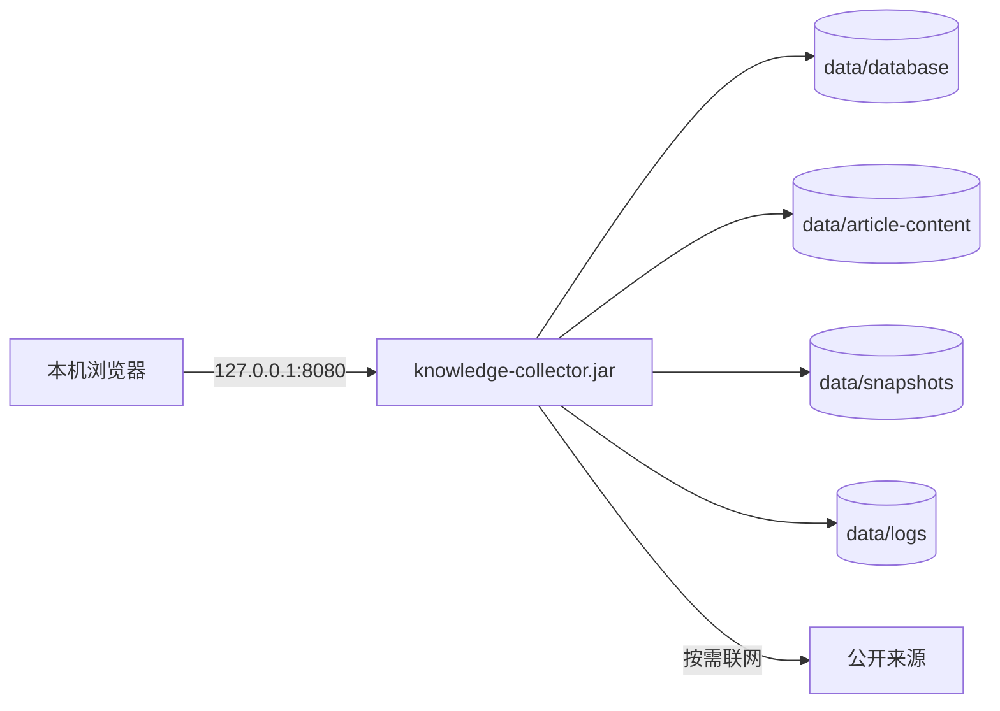

# 系统概要设计

## 1. 架构目标

Knowledge Collector 采用本地部署的模块化单体。目标是以较低运维成本实现清晰边界、可靠采集、安全内容处理和可替换的基础设施端口，同时避免第一版引入分布式复杂度。

## 2. 系统上下文

如果 Mermaid 渲染器不支持 C4 语法，可按同一关系退化为普通流程图，不改变架构含义。

## 3. 总体架构

## 4. 模块划分与依赖

| 模块 | 职责 | 允许依赖 |
| --- | --- | --- |
| domain | 实体、值对象、枚举、领域规则和端口接口 | JDK；尽量不依赖 Spring |
| application | 用例编排、事务意图、命令/查询模型、应用服务 | domain |
| infrastructure | JPA、HTTP、RSS/Atom、Jsoup、存储、调度适配器 | application、domain |
| web | MVC/REST Controller、DTO、校验、模板与静态资源 | application、domain |
| boot | 应用启动、依赖装配、配置与可执行 JAR | infrastructure、web |

依赖方向禁止反转：domain 不引用 infrastructure/web；application 不引用具体 JPA、HTTP 或模板实现。

## 5. 分层与端口适配器

Controller 只做协议转换、校验和调用；事务边界由应用服务定义；基础设施适配器不包含跨用例业务流程。

## 6. 采集与内容数据流

## 7. 采集时序

## 8. 调度流程

Spring `@Scheduled` 只负责周期触发“扫描到期来源”用例。应用层使用数据库任务记录保证可观察性，并通过同一来源运行锁避免重入。动态 Cron 管理不属于第一版；周期参数从配置或系统设置读取并设置安全下限。

## 9. 数据与文件存储

- H2 文件数据库保存结构化元数据、清洗 HTML、纯文本、摘要和状态。
- 原始 HTML/页面快照仅在来源允许且管理员启用时保存到 `data/` 下，数据库记录相对路径。
- 路径由 `StorageService` 生成并验证，禁止目录穿越。
- 备份集合至少覆盖 H2 文件、文章内容/快照和必要配置；日志与临时导出默认可选。

## 10. HTTP 与合规架构

`WebContentClient` 统一实施连接/读取超时、最大响应、重定向、User-Agent、Accept-Language 和有限重试。`RobotsPolicyService` 在页面抓取前决策；来源配置控制是否仅摘要、是否保存快照和请求间隔。401/403、验证码、登录或付费墙不会触发绕过逻辑。

## 11. 异常处理

- 领域异常：规则不满足，例如禁用来源、非法状态转换。
- 应用异常：用例资源不存在、并发冲突、重复请求。
- 基础设施异常：网络、解析、数据库和文件 I/O。
- Web 层映射为统一错误结构；任务型异常同时落入任务/任务项。
- 错误消息对用户可理解，详细堆栈只进入本地日志。

## 12. 日志与审计

日志使用关联 ID、任务号、来源 ID 和文章 ID，不记录完整 Cookie、Token 或正文。审计日志记录配置、状态、删除、备份等管理动作；高频采集明细进入任务项而非审计表。

## 13. 安全设计

- 默认监听 `127.0.0.1`，第一版不开放远程访问。
- 仅渲染经过 Safelist 清洗的 HTML。
- 外链使用 `noopener noreferrer`，拒绝 `javascript:` 等协议。
- 所有输入使用 Bean Validation 与服务层不变量双重校验。
- 文件路径规范化后必须位于配置的数据根目录内。
- 后续 Spring Security 可在 web/boot 层加入，不污染 domain/application。

## 14. 部署架构

## 15. 技术基线

- Java 17。
- Spring Boot 3.5.16；官方文档要求 Java 17 与 Maven 3.6.3+。
- Maven 多模块聚合。
- Stage 2 只创建可解析骨架；Stage 3 才加入启动类、配置、迁移和运行验证。

参考：[Spring Boot 3.5 Maven Plugin 官方文档](https://docs.spring.io/spring-boot/3.5/maven-plugin/index.html)。

## 16. 扩展路线

- 新 Provider：实现 `CrawlProvider` 并注册支持类型。
- 新分类器/搜索/存储：替换端口实现。
- 本地 Lucene：新增 infrastructure 搜索适配器。
- 浏览器采集：作为独立 Provider，仍受合规与限速策略约束。
- 多用户：在 web/boot 加认证授权，并为数据模型增加所有者边界。
